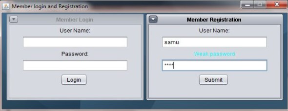
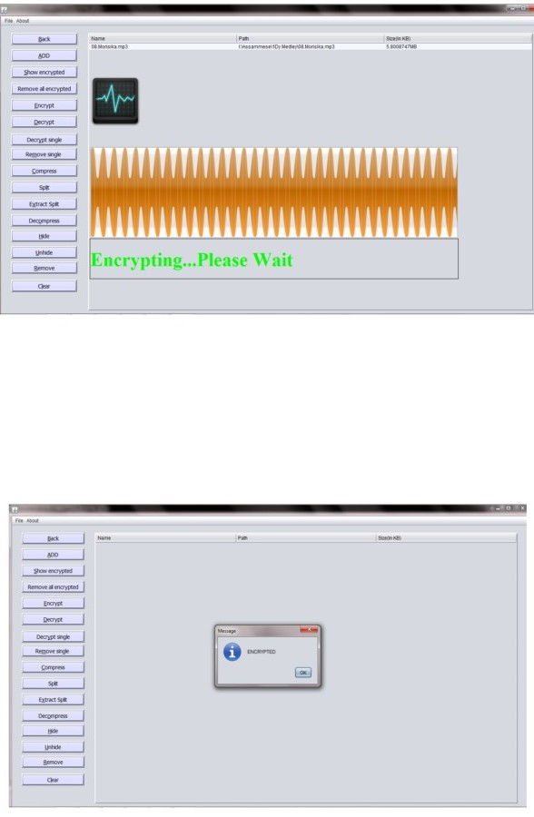
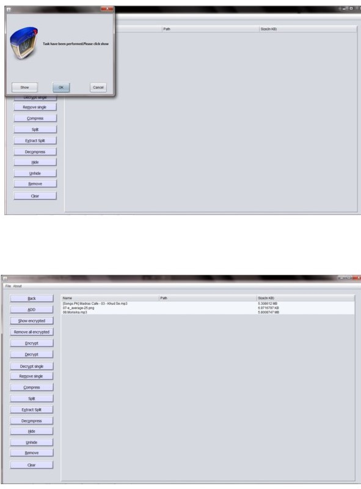
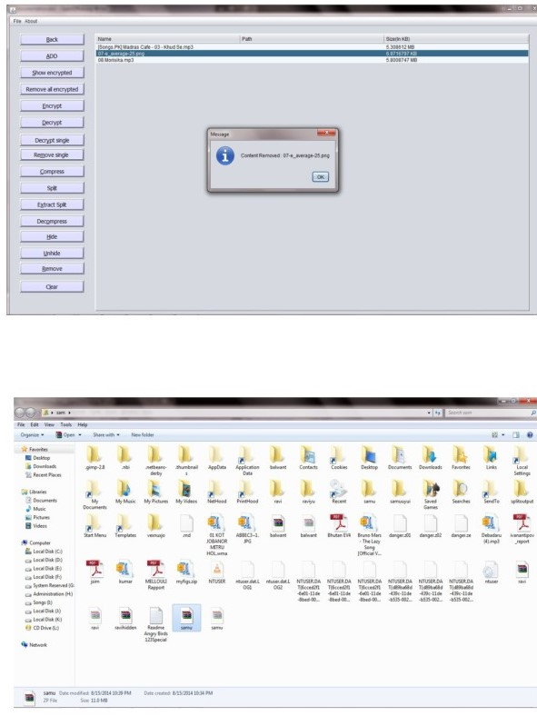
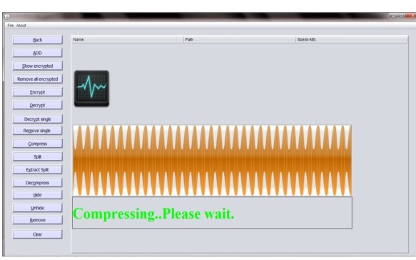
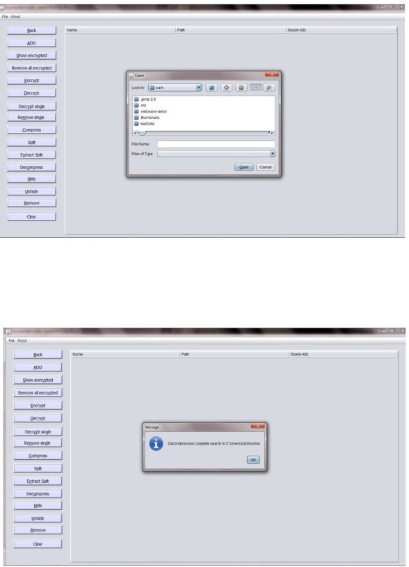
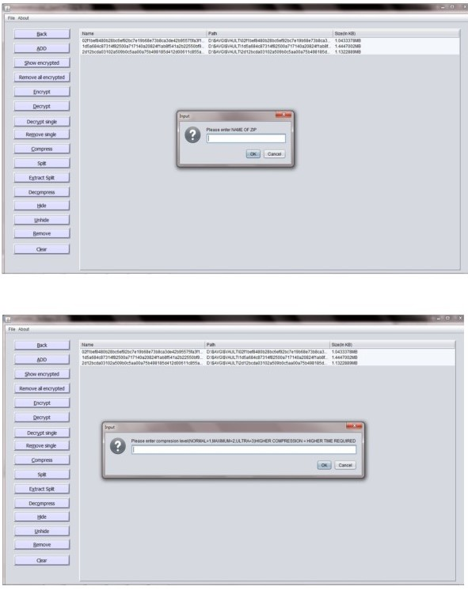
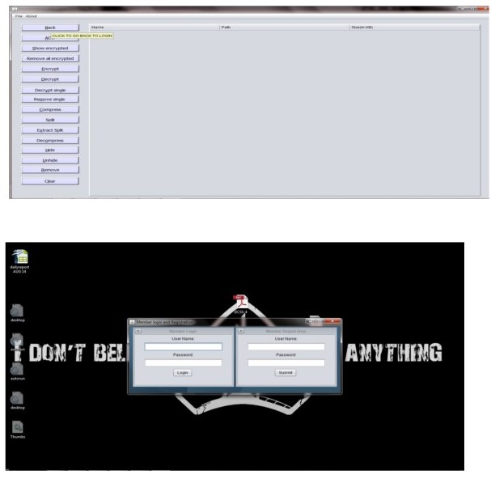

Crypt Clocker

Data encryptor, hider and compressor.

Chapter 8: Screenshots

8.1: Login and Account Creation

This is the first window that appears when the application project of Crypt Clocker is

runned. It provides the following features.

1. Internal frame (Member Registration and Member Login)

2. Text Field (User Name and Password in Member Registration and Member

Login)

3. Button Submit in Member Registration and Login in Member Login

Run the application and when window appears asking for registration or login, please

register using password and a username and clicking "Submit button”. Once

registered please login through the username and password press button "Login"

after this the main application window appears where you can perform your task.

Note. Please remember login is case sensitive so please be cautioned.

8.2. Main Window:

This is the main window of the application project “Crypt Clocker” it from this

window all other windows and task are performed, it is main interface.

It has the following components

I.  Menu Bar: Crypt Clocker has also a simple menu bar; user can select their

desired menu from menu bar. Like File and About.

File itself houses open and save menu item.

About houses Help and Product Info.

II.  Table: This is component used to show information and as a way to store file

details to be used to perform other tasks. It shows 3 details and they are Name,

Path and Size.

III. Buttons: All tasks are performed via press of buttons. The buttons used are

ADD,Back,Show encrypted, Remove all encrypted,Encrypt,Decrypt,Compress

,Decompress,Remove,Remove single, Decrypt single, Split ,Extract

split,Hide,Unhide,Clear,Decrypt single.

Addition of files to be worked with can be done via many methods

Through add button: To do this press "add" button this will open a new window .In

this window files can be added through dragging required files from the folder and

dropping them to the window. Another way to add files is through right mouse click

which opens a popup menu where add row can be selected to add files through open

dialog box. Through other options like the table or selected row can be cleared. After

required content are added press button "Export".

Through  open  menu  item:  To  do  this  first  go  to  "File"  in  menu  bar,  then  select

"open" option. This open’s open dialog box in the open dialog box browse through

files  and  open  the  required  one  by  selecting  and  the  press  in  "open"  button.  If

multiple files has to be added press ctrl key in keyboard and select the files and then

press "open' button.

Once required content are added content can again be removed by pressing button "Remove" to

remove selected or "Clear" to remove all. After this press button "Encrypt" if successful a message

dialog will apear.Before encryption a dialog will ask if question to encrypt or not(this dialog will

be displayed every time a task is needed to be done) if yes button is pressed task will be continued

otherwise it would be stopped. During encryption a glass pane will be activated that will block any

event like mouse or key click till encryption is complete.

8.5 DENCRYTING:

To decrypt please press button "Decrypt”. If successful a dialog box appears, to view

content press button "Show" in the dialog box. All others operations are same as

encrypting like asking for permission, showing glass pane etc.

To view encrypted files present press button "Show encrypted".

To decrypt a single file press "Show encrypted" button and then select the required file and then

press button "Decrypt single" button.

To remove content from encrypted content select file and then press button "Remove single".

To remove all content from encrypted content press button "Remove all encrypted".

The decrypted content is present in the folder with the same name as the username.

8.6 COMPRESSING:

To compress first add content as in done in <A HREF="file:///C:/Users/sam/Desktop/NetBeansProjects/CryptClocker/src/data/help.html#enc">encryption</A>  and then press button

"Compress”. All others operations are same as encrypting like asking for permission,

showing glass pane etc.

8.7 DECOMPRESSING:

To decompress press button "Decompress" which will open a dialog box where

select the required zip file to decompress.

After completion of Completion of task the usual dialog box with show button

appears.

8.8 CREATE SPLIT ZIP:

To create split archive press button "Split" which opens a dialog where enter name of

archive.

After this another dialog appears asking for compression level.

Then another dialog appears where enter the size of each split archieve.If not entered

properly default values will be taken.

8.9 MERGING AND DECOMPRESSING:

In this phase split archive is merged and decompressed. To do this press button

Extract split and then select the split zip to be extracted. All others operation are as

usual operations.

8.10 REMOVE, LOGOUT (BACK), CLEAR:

To go back to the Login window press button "Back”. After button press.

Before removal

To remove single row press button "Remove".

After removal of middle row.

To clear the table press button "Clear".

After clear.

8.11 SAVE DIALOG : User to select the folder where content will be saved, please

click File in menu bar then save to open save dialog and then select location and

press “save” button .By default location is c/user/username in windows or equivalent

in other platform .

8.12 PRODUCT INFO:

To view about us click about a then "Product info”. This window shows some basic

information about the application project.

8.13 HELP: It shows all the available features of the Software for the new user. To

view help click About, then help.

